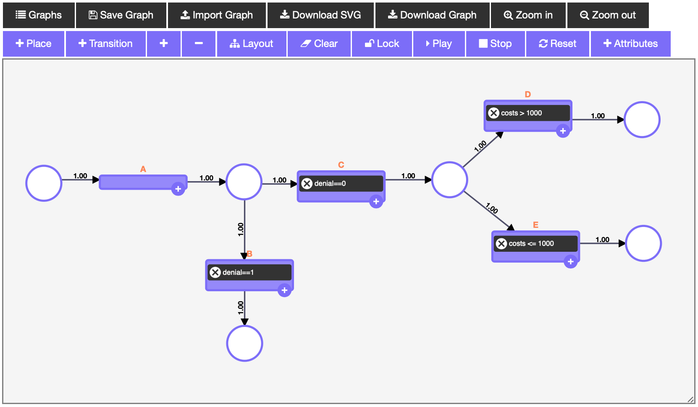

# ipypetrinet

[](https://travis-ci.org/DFKI/ipypetrinet)
[](https://codecov.io/gh/DFKI/ipypetrinet)

A custom petrinet widget.

## Installation
You can install the package using `pip`:

```bash
pip install ipypetrinet
```

You may also need to install `pm4py`, `time`, `datetime`, `numpy`, `pandas` and `copy`!

If you are using Jupyter Notebook 5.2 or earlier, you may also need to enable
the nbextension:
```bash
jupyter nbextension enable --py [--sys-prefix|--user|--system] ipypetrinet
```

If the widget is not displayed, make sure you have `notebook` installed with the latest version.
You can update it by typing:
```bash
pip install --upgrade notebook
```

## Usage

```bash
from ipypetrinet import PetriWidget
widget = PetriWidget()
```



The Widget consists of 18 buttons and a resizable canvas. The functionality of each button is briefly described below. 
After adding cells (places or transitions) to the canvas, you can connect them via a link by clicking and holding `alt-key` and then dragging the source-cell to the destination-cell. You can only add links between places and transitions. Note that you can assign labels to places and transitions and probabilities to links. By double-clicking a cell or a link you can modify the label or probability respectively. Transitions can be enriched with custom conditions by clicking the attached add-button. Please also note that the canvas can be resized by dragging the lower-right corner up or down.

- `Graphs` will show a dropdown of two example graphs, which can be selected to play around with.
- `Save Graph` will save the currently displayed graph in the `Graphs` dropdown. (CAUTION: It will only be stored temporarily in the local storage of the browser)
- `Import Graph` allows you to import a JSON- or PNML-file as a graph to be displayed in the widget. This also restores available conditions, case- and event-attributes of the imported model. If the PNML-file does not provide proper position-attributes, its approximate layout will be restored automatically.
- `Download SVG` allows you to download the current graph as SVG.
- `Download Graph` allows you to download the current graph as JSON- or PNML-file, which may be imported in another session to resume working. It also stores the corresponding conditions, case- and event-attributes.
- `Zoom in` and `Zoom out` will enlarge or shrink the graph.
- `+ Place` will add a new place to the canvas.
- `+ Transition` will add a new transition to the canvas. Please keep in mind that transitions always need a label. Within the transitions, conditions can be added using the attached add-button.
- `+` will add a token to a previously selected place. You can select places or transitions by simply left-clicking them. Note that transitions cannot contain any tokens, while places may contain any positive number of tokens.
- `-` will subtract a token of a previously selected place. Note that a place cannot contain a negative number of tokens.
- `Layout` gives the user the possibility, to automatically generate a layout for the given graph. There are four parameters that can be customized in order to obtain the desired result.
- `Clear` will delete the whole graph off the canvas. You can now start over with a fresh canvas. (CAUTION: at this point in time this cannot be revoked)
- `Lock` will freeze the whole model, so cells can't be moved around or deleted anymore. However, you can still modify the properties of cells by double-clicking them.
- `Play` will simulate the Petri net. Please mind that this simulation-mode doesn't take any conditions, case- and event-attributes or probabilities into account.
- `Stop` will stop the current simulation. (CAUTION: clicking `Play` twice without clicking `Stop` in between will cause undefined behavior.)
- `Reset` will reset the model to the state it had the last time a token was added or removed. Moreover, the graph is set back to its initial position and the zoom-level is reset.
- `+ Attributes` will open a popup which allows you to add and delete both case- and event-attributes. A few options for the dynamic generation of variables are already supported (static list with probabilities, normal-, binomial-, gamma- and exponential-distribution). Please note, that you have to choose a certain transition to be extended by the respective event-attribute. 

Beyond that, you can implement a custom Python method, defining data-attributes and pass them to the `generate_eventlog` function. The function should provide these attributes in the following form: 
```bash
datadict = {"resource": "Emma", "costs": {"A": 10, "B": 20}}
```
Here, the "resource" is handled as a case-attribute whereas the "costs" are defined as a event- or shared-attribute.
Furthermore, the PetriWidget comes with two attributes and a readily implemented simulation functionality. The attributes may be obtained by typing `widget.graph` and `widget.caseAttrs`. If you want to draw the net once again using gviz, you can run `widget.drawPetriNet(widget.graph)`. However, the main and most interesting function is `widget.generate_eventlog(graph=widget.graph, case_attrs=widget.caseAttrs)` which will simulate an event log as a pandas DataFrame and compute the respective event-attributes and case-attributes dynamically. There are several optional parameters that can be modified. Additionally, some basic methods are included to subsequently contaminate the event log with noise like silent or double activities, missing start/end or randomly switching timestamps. 
Hint: by typing `widget??` in a jupyter notebook, all implemented methods (including helper methods) can be inspected.


## Development Installation
Create a dev environment:
```bash
conda create -n ipypetrinet-dev -c conda-forge nodejs yarn python jupyterlab
conda activate ipypetrinet-dev
```

Install the python. This will also build the TS package.
```bash
pip install -e ".[test, examples]"
```

When developing your extensions, you need to manually enable your extensions with the
notebook / lab frontend. For lab, this is done by the command:

```
jupyter labextension develop --overwrite .
yarn run build
```

For classic notebook, you need to run:

```
jupyter nbextension install --sys-prefix --symlink --overwrite --py ipypetrinet
jupyter nbextension enable --sys-prefix --py ipypetrinet
```

Note that the `--symlink` flag doesn't work on Windows, so you will here have to run
the `install` command every time that you rebuild your extension. For certain installations
you might also need another flag instead of `--sys-prefix`, but we won't cover the meaning
of those flags here.

### How to see your changes
#### Typescript:
If you use JupyterLab to develop then you can watch the source directory and run JupyterLab at the same time in different
terminals to watch for changes in the extension's source and automatically rebuild the widget.

```bash
# Watch the source directory in one terminal, automatically rebuilding when needed
yarn run watch
# Run JupyterLab in another terminal
jupyter lab
```

After a change wait for the build to finish and then refresh your browser and the changes should take effect.

#### Python:
If you make a change to the python code then you will need to restart the notebook kernel to have it take effect.
